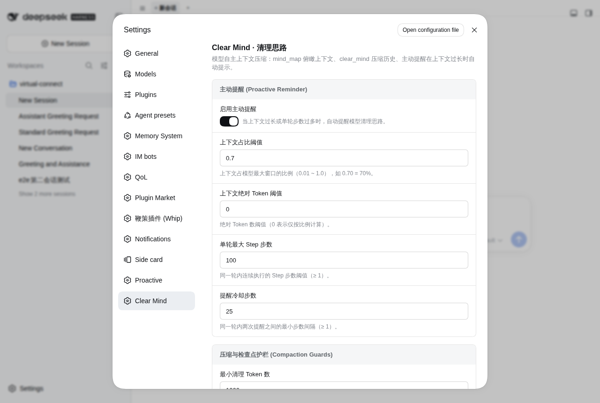

# dsh-clear-mind

<p align="center">
  <a href="./README.md"><strong>简体中文</strong></a> ·
  <a href="./README.en.md"><strong>English</strong></a>
</p>

让模型自主压缩自身上下文的 DeepSeek Harness 插件（cordis plugin）：当失败探索和大输出把上下文拖累时，模型调用 `clear_mind`「清空脑子」——把一段对话历史替换成自己写的检查点，只留笔记，释放注意力与 token 预算。人类侧的会话记录始终原样保留，每次清理在 GUI 里都是一条可展开的压缩行。




## 模型看到什么

**`mind_map`** 俯瞰模型自己的上下文表面：每条消息的稳定 seq、角色、token 重量、一行预览，按 turn 分组；`▸` 标记合法区间起点、`◂` 合法区间终点、`◆` 既有检查点，末尾内附 clear-mind 操作手册（何时清、怎么选区间、怎么写 notes、提交前自检）：

```
Mind surface: 31 nodes, ~41.2k tokens; request pressure ~41.2k tokens.
Seqs are ids in surface order (the list is NOT numeric-sorted after any clear/compaction) — use them as identities, not as an interval.
Range boundaries are marked ▸ (may start a clear) and ◂ (may end a clear); ◆ marks a prior checkpoint. Latest clearable end: seq 24.

turn 1 · seqs 1-10 · 10 nodes · ~15.3k tok — 帮我排查插件的构建报错
 ▸    1   ◆user      1.20k "帮我排查插件的构建报错"
      2    assistant   340 "我先看一下 tsc 的报错输出。"
      4    tool      4.90k "bash · npm run build"
      8 ◂  assistant   260 "构建通过。总结：include 里漏了 scripts 目录。"

turn 2 · seqs 11-24 · 14 nodes · ~18.9k tok — 还是报错，试试换一种打包方式
 ▸   11    user        900 "还是报错，试试换一种打包方式"
     24 ◂  assistant   350 "client bundle 正常加载了，问题解决。"

— clear-mind playbook —
选区间：清「已完成的旧阶段」或「可收敛支线/弯路」；至少保留最近 1-2 个回合原文……
提交前自检（防丢）：每个未完成要求都在？后续要用的路径/标识符/数字都逐字在？……
```

**`clear_mind(start, end, notes)`** 把 `[start..end]` 区间替换为模型自己提炼的检查点，走平台原生 compaction 事务（start → summary → replace → end），GUI、token meter 与后续自动压缩都认识它；失败路径 fail-closed，绝不留下不闭合的事务：

```
Cleared 24 messages (~34.2k tokens) into checkpoint seq 25. Surface: ~41.2k → ~9.6k tokens.
Your clear_mind call and this result fold into a one-line tombstone at the next step boundary;
the checkpoint now stands for the cleared span. Reorient briefly (goal, constraints, next step), then continue.
```

下一步边界上，这次调用与返回自动折叠成一行墓碑；GUI 中检查点渲染为原生压缩行（「已压缩 N 条历史记录」，可展开 notes）。

**主动提醒**：上下文涨长或单轮步数过多时，插件在下个 step 边界注入一条 `<system-reminder>` 提醒模型主动清理（阈值与冷却见下文配置）：

```
<system-reminder>
[Context / Step Alert] 当前会话已达到主动清理检查点：
- 原因：上下文已占模型窗口的 71%（95200/128000 tokens，阈值 70%）
- 建议：长上下文或单轮过多 Step 容易累积过时试错过程与冗余工具输出，分散注意力并增加推理成本。
- 行动指引：先调用 mind_map 审视当前上下文表面，然后将已完成阶段/可收敛支线通过 clear_mind 压缩为检查点，剔除噪音留下有用信息。若手头工作尚未完成，先把这一阶段的工作做完再清理即可。
</system-reminder>
```

## 行为规则

- **仅根代理注册工具**：`mind_map` / `clear_mind` 只注册给 root agent；子代理上下文天然短命，保持平台自动压缩，不开放自改历史。
- **seq 是身份不是数值**：replace 后 surface 的 seq 非单调，地图头部明确警示；提交时对边界做全量校验，`start` / `end` 也接受 `first` / `latest` 哨兵。
- **多段清理**：多个不相交区间各调一次 `clear_mind`，每段独立校验、独立生成检查点。
- **自折叠**：已提交的 `clear_mind` 与已消费的 `mind_map` 调用对在下一步边界自动折叠成单行墓碑（compaction/prune + user/message replace 影子价格协议），不留死重。
- **影子价格协议**：每次 replace 紧跟携带精确 shadowedRange/shadowedSeqs/shadowedTokenCount 的 `compaction/summary`，与平台压缩引擎逐字节同构，token meter replay 安全。
- **护栏防退化**：低于 `minClearTokens` 的琐碎清理、notes 过短/超长的提交都会被拒绝，模型收到可执行的错误信息。
- **人类侧记录不动**：append-only 日志是唯一事实源，清理通过平台事务词汇表达，GUI 原文保留、可审计可回退（dsh-rewind）。

## 配置（可选）

```yaml
- id: clear-mind
  name: dsh-clear-mind
  config:
    minClearTokens: 1000        # 最小可清理量（启发式 tokens），防琐碎清理
    minNotesChars: 200          # 检查点 notes 最短长度
    maxNotesChars: 16000        # 检查点 notes 最长长度
    selfCollapse: true          # 自动折叠 clear_mind / mind_map 调用对
    playbookStyle: engineering  # 提示词风格：engineering（工程化）| natural（口语化）
    presetPlaybookStyle: {}     # 按 agent preset 覆盖风格，如 { roleplay: natural, agent: natural }
    reminderEnabled: true       # 主动提醒开关
    reminderThresholdRatio: 0.70   # 上下文占模型窗口比例阈值（0.01~1）
    reminderThresholdTokens: 0     # 绝对 token 阈值（0 = 仅按比例）
    reminderThresholdSteps: 100    # 单轮步数阈值
    reminderStepInterval: 25       # 同一轮两次提醒的最小步数间隔
```

Web 前端可在设置页直接编辑以上全部参数（命名空间 `clear-mind`），保存即热生效，无需重启；headless profile 无设置服务时自动降级为仅配置文件生效。提醒触发还要求 token 数较上次提醒有增长——静止的会话不会重复打扰。

**提示词风格（按 preset 区分）**：`playbookStyle` 设定默认风格；`presetPlaybookStyle` 可按 session 的 agent preset 覆盖（如 `roleplay: natural`）。`natural` 风格把 mind_map 返回的清理指引、工具描述里的「何时梳理」信号、以及主动提醒文案都换成口语化表述——没有 `##` 模板样例和工程黑话，适合 roleplay / 陪伴类 preset；地图本身的协议语义（seq、边界标记）不受影响。风格在 agent 注册时按 session header 里持久的 `agentPreset` 解析，改动对之后创建的会话生效。

## 安装

```bash
dsh plugin --profile web add dsh-clear-mind
```

安装后无需手动改配置，插件自带的 `cordis.patch.yml` 自动挂载，重启 dsh 后模型即获得两个工具；所有参数都有合理默认值。

从 GitHub 直装（源码安装，pnpm ≥10 需允许构建脚本）：

```bash
dsh plugin --profile web add github:john-walks-slow/dsh-clear-mind
# 首次 add 会被 pnpm 拦截：把 pnpm 提示的包名加入
# ~/.dsh/profiles/web/pnpm-workspace.yaml 的 allowBuilds 后重跑
```

## 权限与兼容

- **零网络、零外部服务**：不发起任何网络请求，不写文件系统；仅通过平台 compaction 事务词汇改写会话 surface
- **依赖**：`@deepseek-ai/cordis` 4.0.2 / `@deepseek-ai/dsh-session` · `dsh-llm` · `dsh-compaction` · `dsh-tools` 0.1.2-rc.1（与 dsh 0.1.2-rc.1 锁定版本对齐），Node ≥ 22.5
- **平台要求**：绑定平台 `ctx.tokenMeter`（MeterPort）；工具注册依赖 `ctx.agents.roots()`；设置页为可选增强（无 settings 服务自动降级）
- **不影响子代理**：子代理保持平台自动压缩，行为零改变
- **与自动压缩共存**：本插件在平台 autocompact 之前给出语义边界可控的手动出口；两者不冲突

## 本地开发

```bash
npm install
npm run check   # tsc --noEmit（src+test）
npm run build   # 产物 dist/src/ + lib/client.js（web 设置页）
npm test        # tsc(含 test) + node --test dist/test/*.test.js，47 用例
```

单测用启发式 meter 副本与真实 Session 构造（含影子价格全日志断言）；运行时绑定平台 `ctx.tokenMeter`。

- 平台契约与开发纪律见 `AGENTS.md`；调研/计划/检视文档见 `docs/features/`

## 发新版

改动入库后一条命令完成测试、版本号、打包（`npm version` 会自动 commit 并打 tag）：

```bash
npm run release        # patch；较大更新改用：npm version minor 或 major
```

然后指纹发布并推送：

```bash
node ~/.agents/skills/npm-publish/scripts/publish-webauthn.cjs /tmp/dsh-clear-mind-<新版>.tgz
git push --follow-tags
```

发布后 `npm view dsh-clear-mind version` 复验。批量发多个包时，在指纹页勾选“5 分钟内同 IP 不再挑战”，一次指纹即可连发。
